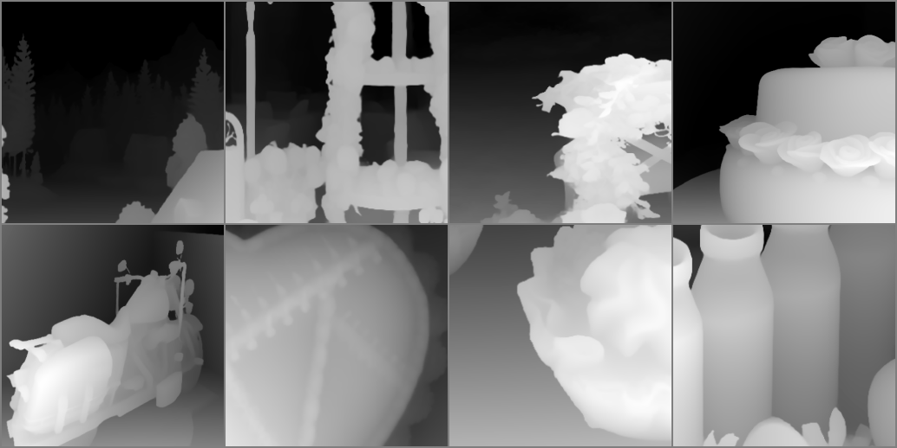
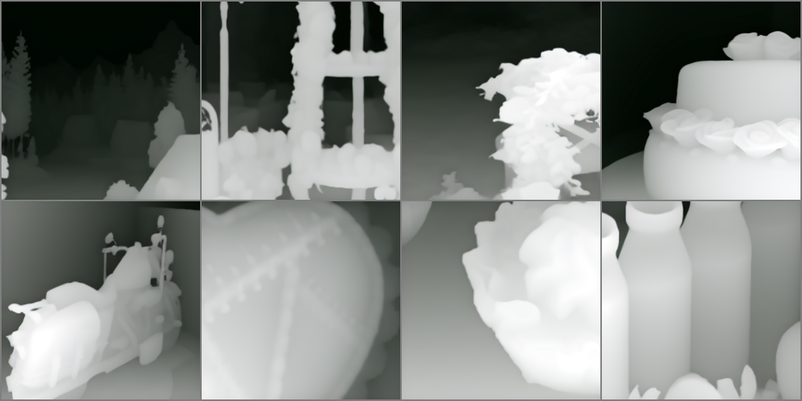

# 前言

为了让 decoder 更适应一个特定的分布，我们可以考虑将 SD 的 encoder 不变，而将 decoder 进行微调，这样可以保证不影响 Unet 的性能。之前跑通过 Latent Diffusion Model（LDM）的框架，但过程非常复杂，而且后来代码丢失了，所以我开了新的仓库打算进行记录。

# 环境

安装 LDM 的环境：

```bash
conda create -n ldm python=3.10
conda activate ldm
pip install -r requirements.txt
pip install -e git+https://github.com/CompVis/taming-transformers.git@master#egg=taming-transformers
```

# 步骤

### 第一步：下载你要微调的 diffusers 模型

如果你可以找到 LDM 版本的原始模型，这一步可以省略。

使用 `convert_diffusers_vae_to_ldm.py` 脚本将 diffusers 模型转换为 LDM 模型：

```bash
python convert_diffusers_vae_to_ldm.py --model_path /path/to/diffusers_model_directory
```

### 第二步：根据要求修改 VAE 模型的 yaml 文件

正常 SD 模型的 VAE yaml 文件如下：

```yaml
model:
  base_learning_rate: 4.5e-6
  target: ldm.models.autoencoder.AutoencoderKL
  params:
    monitor: "val/rec_loss"
    embed_dim: 4
    lossconfig:
      target: ldm.modules.losses.LPIPSWithDiscriminator
      params:
        disc_start: 50001
        kl_weight: 0.000001
        disc_weight: 0.5

    ddconfig:
      double_z: True
      z_channels: 4
      resolution: 256
      in_channels: 4
      out_ch: 4
      ch: 128
      ch_mult: [ 1,2,4,4 ]  # num_down = len(ch_mult)-1
      num_res_blocks: 2
      attn_resolutions: [ ]
      dropout: 0.0

data:
  target: main.DataModuleFromConfig
  params:
    batch_size: 12
    wrap: True
    train:
      target: ldm.data.imagenet.ImageNetSRTrain
      params:
        size: 256
        degradation: pil_nearest
    validation:
      target: ldm.data.imagenet.ImageNetSRValidation
      params:
        size: 256
        degradation: pil_nearest

lightning:
  callbacks:
    image_logger:
      target: main.ImageLogger
      params:
        batch_frequency: 1000
        max_images: 8
        increase_log_steps: True

  trainer:
    benchmark: True
    accumulate_grad_batches: 2
```

我要微调的 `ldm3d-4c` 输入输出通道数都是 4，所以我将 `in_channels` 和 `out_ch` 都改为 4。

`batch_size` 等参数也要在这里设置。

### 第三步：放置数据

把你的 train 图片放在 `./data/ILSVRC2012_train/data/0/` 下，val 图片放在 `./data/ILSVRC2012_val/data/0/` 下，然后运行：

```
python data/ILSVRC2012_train/make_file_list.py
python data/ILSVRC2012_val/make_file_list.py
```

目录格式应该是：

```
data
├── train
│   ├── data
│   │   ├── 0
│   │   │   ├── 1.png
│   │   │   ├── 2.png
│   │   │   ├── xxx.png
│   │   │   └── yyy.png
│   │   │   └── ...
│   ├── file_list.txt
└── valid
    ├── data
    │   ├── 0
    │   │   ├── 1.png
    │   │   ├── 2.png
    │   │   ├── xxx.png
    │   │   └── yyy.png
    │   │   └── ...
    ├── file_list.txt
```

### 第四步：微调

```bash
CUDA_VISIBLE_DEVICES=<GPU_ID> python main.py --pretrained_path xxx.ckpt --base configs/<config_spec>.yaml -t --gpus 0,    
```

`xxx.ckpt` 默认是 `pretrained_path/vae.ckpt`，这也是第一步转化的默认输出位置。替换成实际的 GPU ID 和 yaml 文件，比如我的替换：

```bash
CUDA_VISIBLE_DEVICES=3 python main.py --base configs/autoencoder_kl_32x32x4_ldm3d.yaml -t --gpus 0,   
```

`log` 文件夹下会存下每一次训练的结果。LDM 框架自带了重建前后结果的对比：




